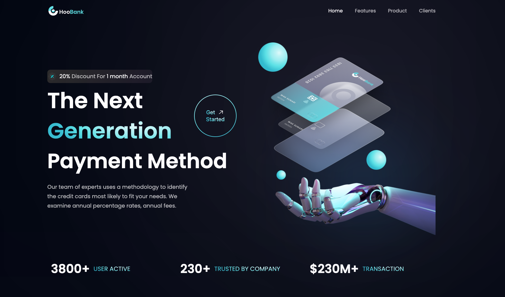
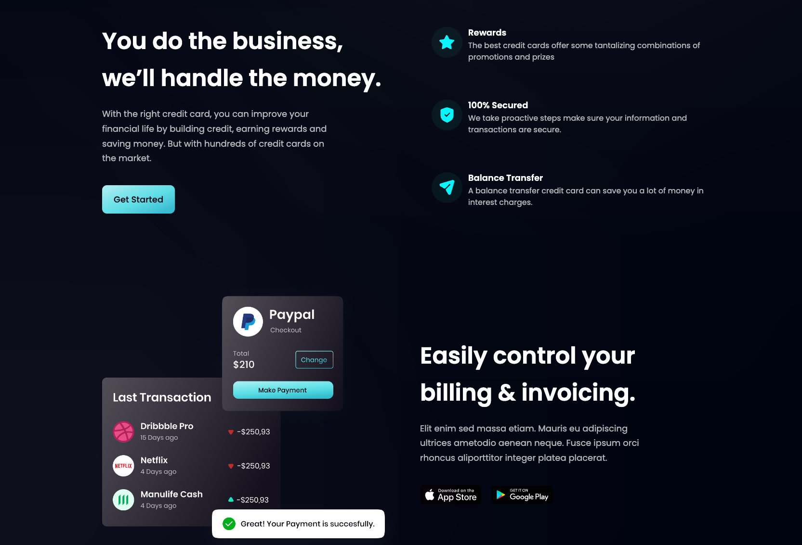
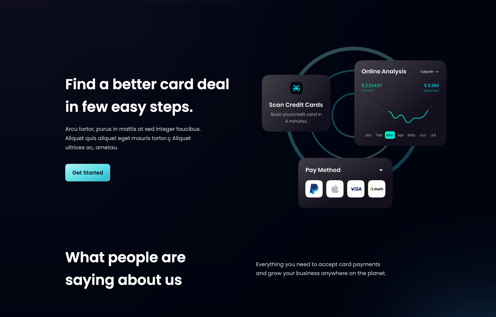
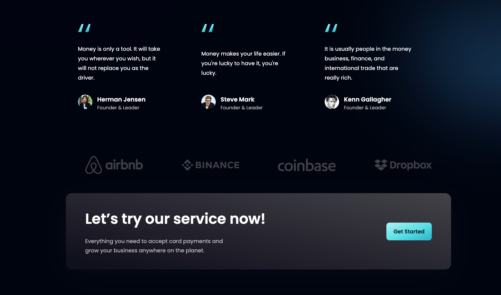
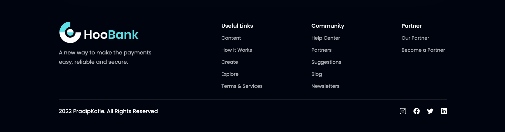

# Hi, I'm Pradip! 👋

## 🚀 About Me

I'm a full stack Javascript Developer...

## 🔗 Links

## About The Project

✅ This is the Banking-website landing page

Key Features:

- Build using React Js and Tailwind Css
- Desktop aswell as mobile responsive design
- Took around 10hr to complete this projct

## 👨🏻‍💻 Build using:

## Screenshots

---

